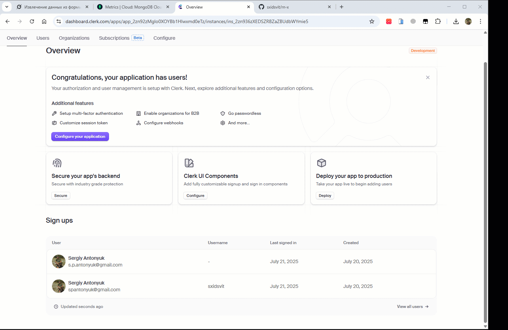

# rn-x

Welcome to **rn-x**, a mobile application built with React Native and Expo. This project demonstrates a modern mobile development workflow with authentication, media management, security features, and a backend powered by Node.js and MongoDB. The application is deployed on Vercel and utilizes advanced services like Clerk, ARCJET, and CLOUDINARY.

## Overview

rn-x provides a seamless user experience with features such as secure user authentication via Clerk, data synchronization with MongoDB, media uploads and management with CLOUDINARY, and rate limiting/security enhancements with ARCJET. It is an excellent starting point for developers exploring cross-platform mobile development and serverless architecture.

## Features

- **User Authentication**: Secure login and registration using Clerk.
- **Data Sync**: Synchronizes user data with a MongoDB database via a custom API.
- **Media Management**: Integrates CLOUDINARY for uploading and managing profile pictures and other media.
- **Security**: Utilizes ARCJET for rate limiting and bot protection.
- **Cross-Platform**: Built with React Native and Expo for iOS and Android support.
- **API Integration**: Includes a Node.js/Express backend for handling API requests.
- **Serverless Deployment**: Deployed on Vercel for scalable hosting.

## Prerequisites

- Node.js (latest LTS version)
- Expo CLI
- MongoDB (local or cloud instance, e.g., MongoDB Atlas)
- Clerk API keys for authentication
- CLOUDINARY API keys and credentials
- ARCJET API key for security features
- Yarn or npm

---

 

---

## Installation

1. Clone the repository:

   ```bash
   git clone https://github.com/sxidsvit/rn-x.git
   cd rn-x
   ```

2. Install dependencies:

   - For the client (React Native/Expo):
     ```bash
     npx expo install
     ```
   - For the server (if included):
     ```bash
     cd server
     npm install
     ```

3. Set up environment variables:

   - Create a `.env` file in the root directory and server directory with the following:
     ```
     NODE_ENV=development
     PORT=5000
     MONGO_URI=your_mongo_connection_string
     CLERK_PUBLISHABLE_KEY=your_clerk_publishable_key
     CLERK_SECRET_KEY=your_clerk_secret_key
     CLOUDINARY_CLOUD_NAME=your_cloudinary_cloud_name
     CLOUDINARY_API_KEY=your_cloudinary_api_key
     CLOUDINARY_API_SECRET=your_cloudinary_api_secret
     ARCJET_KEY=your_arcjet_api_key
     ```

4. Start the server (if applicable):

   ```bash
   cd server
   node server.js
   ```

5. Start the Expo app:

   ```bash
   npx expo start
   ```

6. Use the Expo Go app on your mobile device to scan the QR code and run the app.

## Usage

- Access the app on your mobile device via Expo Go.
- Authenticate using Clerk credentials.
- Upload profile pictures or other media using CLOUDINARY integration.
- The app will sync user data with the MongoDB backend, protected by ARCJET.

## Deployment

- **Client**: Deploy the Expo app to production using `expo publish` or build a standalone app with `expo build`.
- **Server**: Deploy the backend to Vercel:
  1. Push your code to a Git repository (e.g., GitHub).
  2. Connect the repository to Vercel via [Vercel Dashboard](https://vercel.com/new).
  3. Configure `vercel.json`:
     ```json
     {
       "version": 2,
       "builds": [
         {
           "src": "server.js",
           "use": "@vercel/node"
         }
       ],
       "routes": [
         {
           "src": "/(.*)",
           "dest": "server.js"
         }
       ]
     }
     ```
  4. Add environment variables in Vercel Dashboard.
  5. Deploy and access the app at the provided URL (e.g., `https://rn-x.vercel.app`).

## Contributing

Contributions are welcome! Please fork the repository and submit pull requests. Ensure to follow the existing code style and include tests where applicable.

## Contact:

[][linkedin]
[][telegram]
[][github]

[linkedin]: https://www.linkedin.com/in/yourusername
[telegram]: https://t.me/sxidsvit
[github]: https://github.com/sxidsvit

#### Acknowledgements

_A special thanks to [you](https://www.youtube.com/@codesistency) for your invaluable contributions and inspiration._
